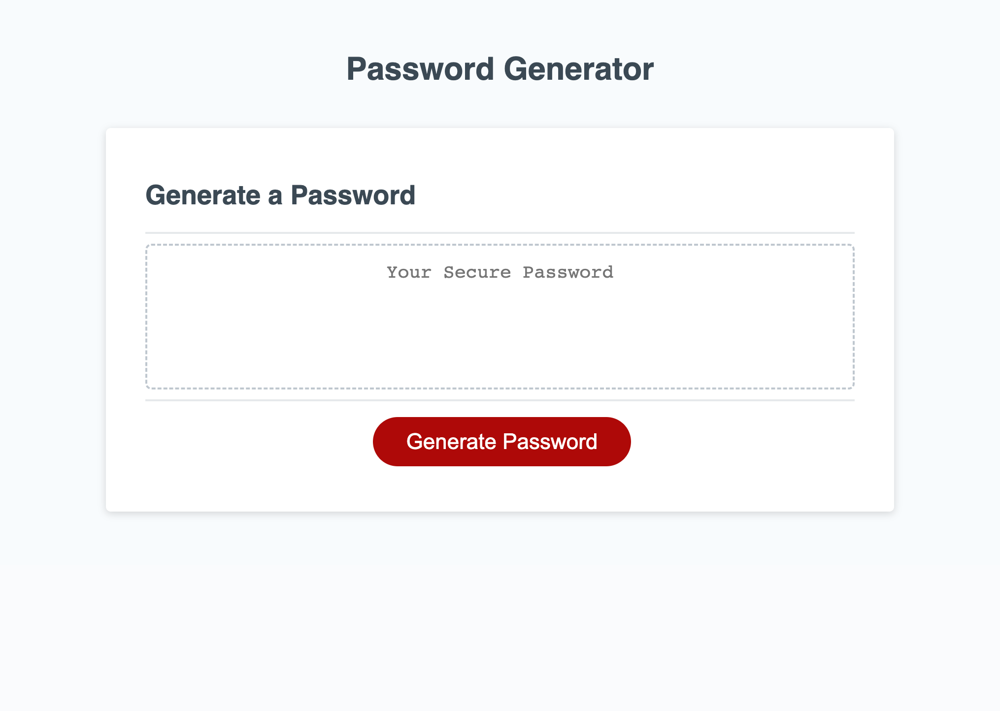
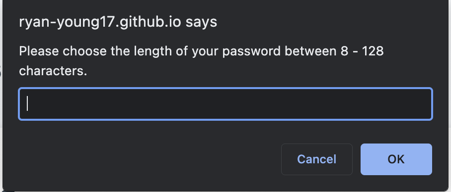
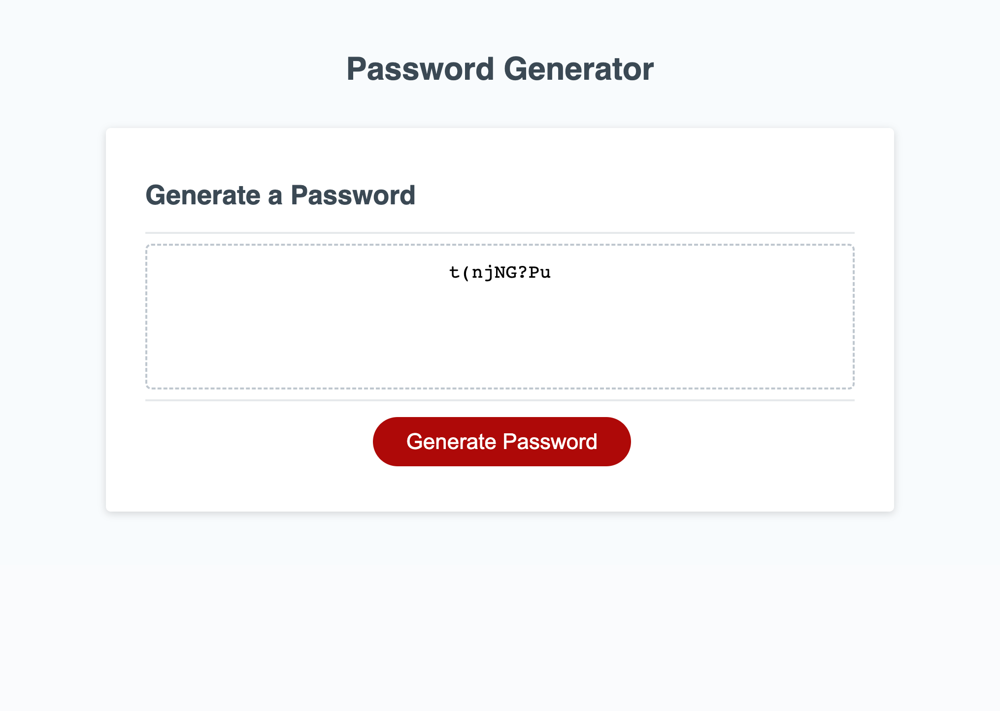

# Challenge 03 - Password Generator

[Link to my project](https://ryan-young17.github.io/generate-password/)

## Table of Contents
- [Description](#description)
- [Visuals](#visuals)
- [Usage](#usage)

## Description

The first step I took in creating this password generator was adding the function named generatePassword to the existing code. I then added the variables for the available options the user would be able to choose from in the function, assigning them confirms, so they would be prompted for each option. Once those were set, I then added variables for each available character: special characters, letters, uppercase letters, and numbers.

Once those variables were set, I set up a parameter for the password length, requiring it to be at least 8 characters and no more than 128--and also set it up in the function to prompt that before choosing the available characters.

In order to have the random password generated, I created if statements for each available option and concatonated them with their perspective variables for a "true" outcome. I also created an if statment for an outcome that didn't include any chosen options and had that result in an alert telling the user they must choose at least one character option. Once these if statements were set, I created a for loop to run each possible outcome at the length chosen by the user.

## Visuals

## Usage

In order to use the Password Generator program, follow these guidelines:

- When the webpage is loaded, you should see what is displayed in the image above.
- Click the red "Generate Password" button.
- When the "Generate Password" button is clicked, you will then be prompted to choose desired password criteria. For Example:

- After completing each of the prompts, a password should be generated on the page as shown below:

